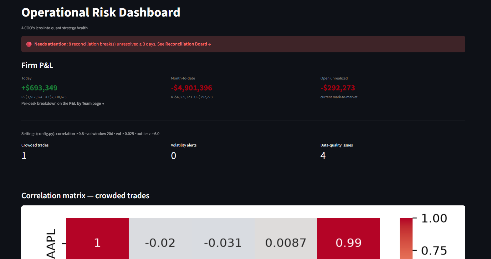
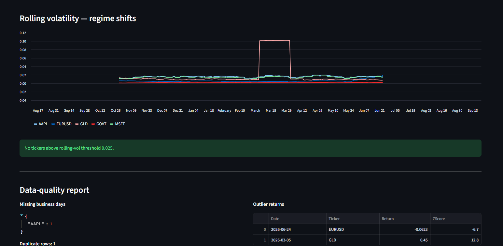
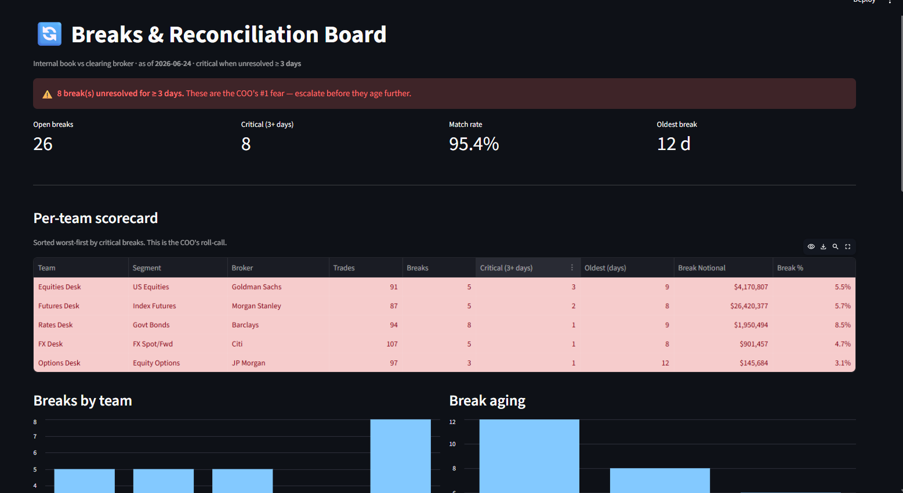
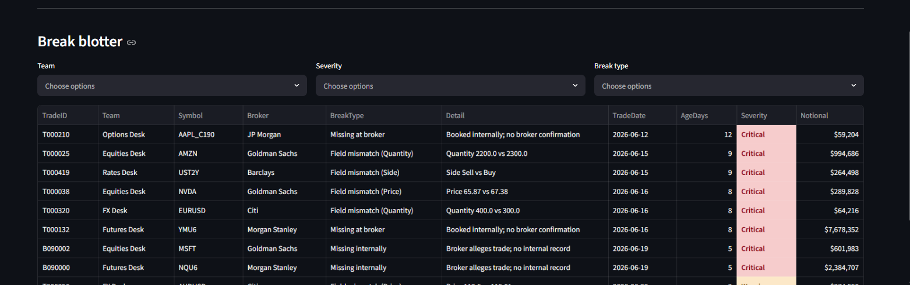
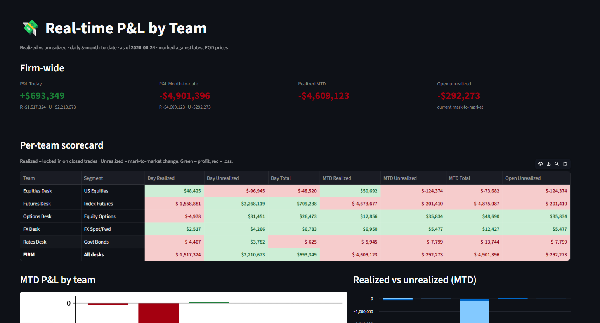

# Operational Risk Dashboard

> *A COO's lens into quant strategy health.*

A Streamlit dashboard that surfaces the five things a quant-firm COO watches every
morning — **reconciliation breaks, real-time P&L, risk/correlation, volatility
regime shifts, and data quality** — as health signals across five trading desks.

---

## 🚀 Quick start (boot up the project)

```bash
# 1. Clone & enter
git clone <your-repo-url> quant_dash
cd quant_dash

# 2. Create an environment (conda or venv — either works)
conda create -n quant-dash python=3.13 -y
conda activate quant-dash
#   …or:  python -m venv .venv && source .venv/Scripts/activate   (Windows: .venv\Scripts\activate)

# 3. Install dependencies
pip install -r requirements.txt

# 4. Generate the sample data (creates the parquet files in data/)
python generate_data.py

# 5. Launch the dashboard
streamlit run dashboard.py
```

The app opens at **http://localhost:8501**. Use the left sidebar to move between the
home page and the **Reconciliation Board** and **P&L by Team** pages.

> **No browser?** Every engine also runs headless as a CLI:
> ```bash
> python pnl.py              # real-time P&L by team
> python reconciliation.py   # breaks & aging report
> python risk_monitor.py     # correlation / volatility / data-quality alerts
> ```

---

## 🖼️ Screenshots

### Home — "Needs Attention" feed, Firm P&L, and risk/correlation



### Reconciliation Board — breaks, aging, and the break blotter



### P&L by Team — realized vs unrealized, daily + MTD


---

## 💡 The story (for the interviewer)

The job is a **COO for quant firms** — owning market data, execution, P&L,
reconciliation, and infra automation. So instead of a generic "risk script," this is
built as the COO's **daily cockpit**: one screen that answers *"what's on fire across
my desks right now?"*

Five desks, each with its own market segment and clearing broker:

| Desk | Segment | Clearing broker |
|------|---------|-----------------|
| Equities Desk | US Equities | Goldman Sachs |
| Futures Desk | Index Futures | Morgan Stanley |
| Options Desk | Equity Options | JP Morgan |
| FX Desk | FX Spot/Fwd | Citi |
| Rates Desk | Govt Bonds | Barclays |

Everything runs on **mock data** — the narrative (operational awareness) matters more
than data volume. All thresholds live in one place (`config.py`) as the single source
of truth, and every panel has both a Streamlit view and a pure-Python CLI engine.

---

## 🧩 What each panel does

### 1. Reconciliation Board — *internal book vs clearing broker*
The COO's #1 fear is an unreconciled break sitting unresolved for days. The engine
matches our trades against the broker's report on `TradeID` and explains every row
that doesn't agree:

- **Break detection & classification** — *field mismatch* (booked both sides but a
  field disagrees), *missing at broker* (we booked it, broker never confirmed),
  *missing internally* (broker alleges a trade we have no record of).
- **Break count per desk** and **break aging** — bucketed Today / 1–2 days / 3+ days,
  with 3+ days flagged **Critical** (red) per `BREAK_AGING_CRITICAL_DAYS`.
- A filterable **break blotter** (by team / severity / type).

### 2. P&L by Team — *real-time realized vs unrealized*
Average-cost accounting walk over the internal book, marked against daily EOD prices:

- **Realized** — locked in when a trade reduces a position: `qty × (exit − avg_cost)`.
- **Unrealized** — open position marked to the latest price.
- **Daily** close-to-close decomposition + **month-to-date**, per desk and firm-wide,
  color-coded red/green, plus an open-positions blotter.
- A self-checking **invariant**: `Σ daily Total == realized-to-date + open unrealized`.

### 3. Risk / correlation — *hidden concentrated bets*
Correlation matrix across instruments, flagging pairs above `CORR_THRESHOLD` (0.8).
The story: two desks both long highly-correlated instruments = one hidden concentrated
bet — surface it.

### 4. Volatility monitor — *regime shifts*
Rolling-window (`VOL_WINDOW` = 20d) standard deviation of returns; alerts when daily
rolling vol crosses `VOL_THRESHOLD` (0.025).

### 5. Data-quality report
Missing business days, duplicate rows, and outlier returns (|z| ≥ `OUTLIER_Z` = 6),
because every number above is only as trustworthy as the feed underneath it.

---

## 📊 Sample data

`python generate_data.py` writes four Parquet files into `data/`. Schemas and
representative rows:

**`portfolio.parquet`** — long-format returns feeding the risk/vol/data-quality panels
*(900 rows)*

| Date | Ticker | PositionSize | Return |
|------|--------|-------------:|-------:|
| 2025-10-16 | AAPL | 193000 | 0.000622 |
| 2025-10-16 | EURUSD | 427000 | 0.002518 |
| 2025-10-16 | GLD | 464000 | -0.005845 |
| 2025-10-16 | GOVT | 159000 | 0.000283 |

**`internal_trades.parquet`** — our books *(476 rows)*

| TradeID | TradeDate | Team | Segment | Broker | Symbol | Side | Quantity | Price | Notional |
|---------|-----------|------|---------|--------|--------|------|---------:|------:|---------:|
| T000001 | 2026-06-09 | Equities Desk | US Equities | Goldman Sachs | NVDA | Sell | 600 | 65.07 | 39042.0 |
| T000002 | 2026-06-09 | Equities Desk | US Equities | Goldman Sachs | NVDA | Buy | 1400 | 65.13 | 91182.0 |
| T000003 | 2026-06-09 | Equities Desk | US Equities | Goldman Sachs | AMZN | Buy | 2400 | 463.81 | 1113144.0 |
| T000004 | 2026-06-09 | Equities Desk | US Equities | Goldman Sachs | NVDA | Sell | 4900 | 65.14 | 319186.0 |

**`broker_trades.parquet`** — the clearing broker's report; same schema, *intentionally*
diverges from internal (extra/missing/edited rows) so breaks appear *(474 rows)*

| TradeID | TradeDate | Team | Segment | Broker | Symbol | Side | Quantity | Price | Notional |
|---------|-----------|------|---------|--------|--------|------|---------:|------:|---------:|
| B090000 | 2026-06-19 | Futures Desk | Index Futures | Morgan Stanley | NQU6 | Buy | 1300 | 1834.39 | 2384707.0 |
| B090001 | 2026-06-22 | Futures Desk | Index Futures | Morgan Stanley | NQU6 | Buy | 100 | 3896.13 | 389613.0 |
| B090002 | 2026-06-19 | Equities Desk | US Equities | Goldman Sachs | MSFT | Buy | 900 | 668.87 | 601983.0 |
| B090003 | 2026-06-23 | Rates Desk | Govt Bonds | Barclays | UST2Y | Sell | 4000 | 98.26 | 393040.0 |

**`marks.parquet`** — daily EOD price per symbol, used to value the P&L book *(252 rows)*

| Date | Symbol | Segment | Price |
|------|--------|---------|------:|
| 2026-06-09 | AAPL | US Equities | 344.28 |
| 2026-06-10 | AAPL | US Equities | 339.96 |
| 2026-06-11 | AAPL | US Equities | 335.60 |
| 2026-06-12 | AAPL | US Equities | 335.35 |

---

## 🗂️ Project layout

```
quant_dash/
├── dashboard.py                  # Streamlit home: Needs-Attention + Firm P&L + Risk panels
├── pages/
│   ├── 1_Reconciliation_Board.py # breaks, aging buckets, filterable blotter
│   └── 2_PnL_by_Team.py          # realized/unrealized P&L, MTD charts, positions blotter
├── reconciliation.py             # break-detection engine + CLI
├── pnl.py                        # average-cost P&L engine + CLI
├── risk_monitor.py               # correlation / volatility / data-quality engine + CLI
├── generate_data.py              # writes the four sample parquet files into data/
├── config.py                     # single source of truth: paths, teams, thresholds
├── data/                         # generated parquet files (gitignored or committed samples)
├── requirements.txt
└── NOTES.md                      # interview-prep planning notes
```

## ⚙️ Configuration

All knobs live in `config.py`:

| Setting | Value | Meaning |
|---------|-------|---------|
| `AS_OF_DATE` | 2026-06-24 | "today" for P&L / aging calculations |
| `CORR_THRESHOLD` | 0.8 | crowded-trade correlation flag |
| `VOL_WINDOW` / `VOL_THRESHOLD` | 20d / 0.025 | rolling-vol regime-shift alert |
| `OUTLIER_Z` | 6.0 | data-quality outlier cutoff |
| `BREAK_AGING_CRITICAL_DAYS` | 3 | break age (days) that turns Critical/red |
| `PRICE_BREAK_TOLERANCE` | 0.005 | price diff tolerated before it's a break |

## 🧰 Tech stack

Python 3.13 · pandas · numpy · pyarrow · matplotlib · seaborn · Streamlit
